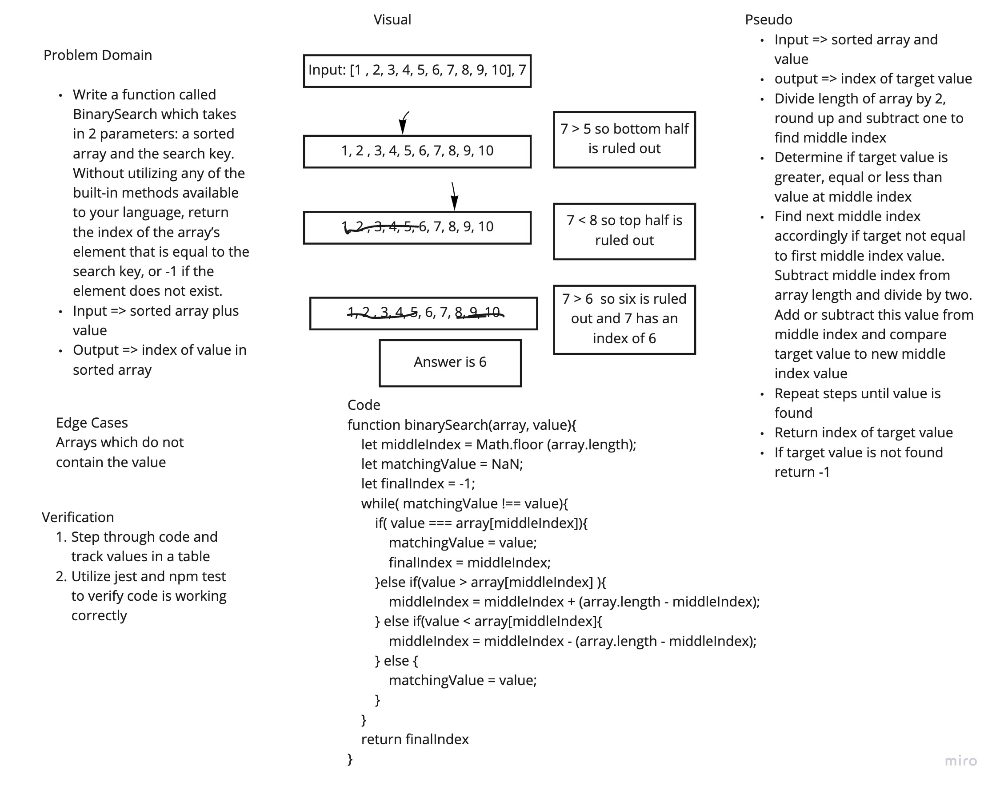

# Array Binary Search
Code Challenge 03 of Code Fellows Class 401

## Challenge
Create a function that will take in an array and a value as parameters and return the index of the value in the original array using a binary search approach.

## Approach & Efficiency
The approach I took was working through a whiteboard for this process. I utilized a while statement with inner if statements to examine whether or not the target value matched the array value at a middle index. If not I found the middle index of the half of the array in which the target value must reside repeating this process until the target is found. I included an else statement to account for the possibility of the target value not being included in the array.

## Solution

## Resources
* After whiteboarding for one hour and spending another half-hour on working on code I utilized the following resource for help. I did not copy the code directly but merely used it as a reference to help push me in the right direction. I felt this was in the bounds of acceptable conduct given I am citing the source but please reach out directly if this is frowned upon.
* https://www.geeksforgeeks.org/binary-search-in-javascript/