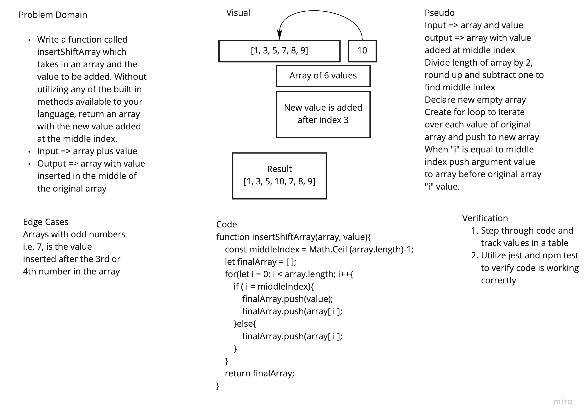

# Array Shift
Code Challenge 02 of Code Fellows Class 401

## Challenge
Create a function that will take in an array and a value as parameters and return the original array with the value inserted at the middle index

## Approach & Efficiency
The approach I took was working through a whiteboard for this process. I utilized a for loop after ascertaining the value of the middle index and pushed the value into the array when i was equal to the middle index.

## Solution
