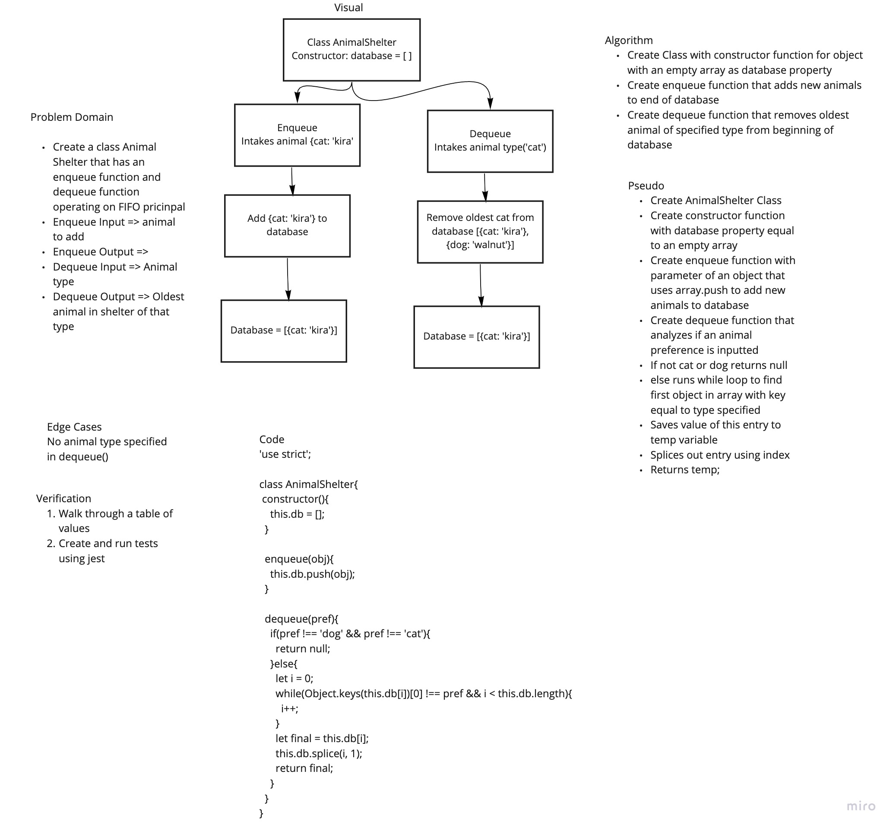

# FIFO Animal Shelter
Code Challenge 12 of Code Fellows Class 401

## Challenge
* Create a class Animal Shelter that intakes animals and removes them in first in first out style

## Approach & Efficiency
* I took the approach of creating functions with O(1) and O(n) Big O space/time.

## Solution

