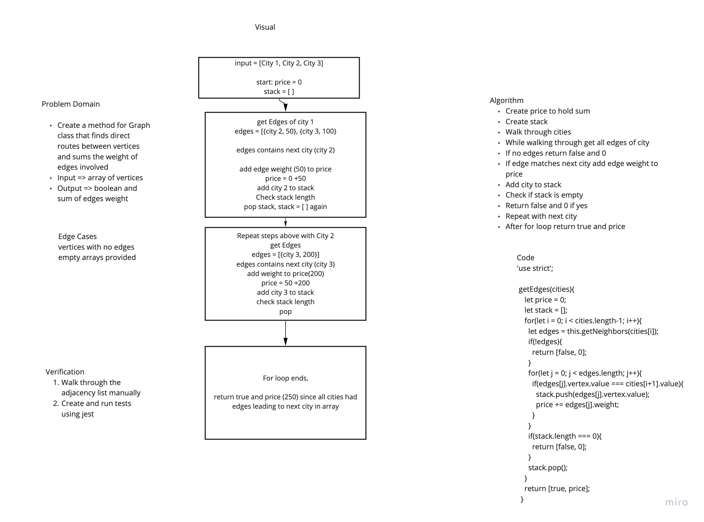

# Get Edges
Code Challenge 37 of Code Fellows Class 401

## Challenge
* Create a Graph prototype for finding direct pathss between vertices and the sum of the weight of the edges involved

## Approach & Efficiency
* I took the approach of creating functions with a O(n^2) time and O(n) space

## Solution
