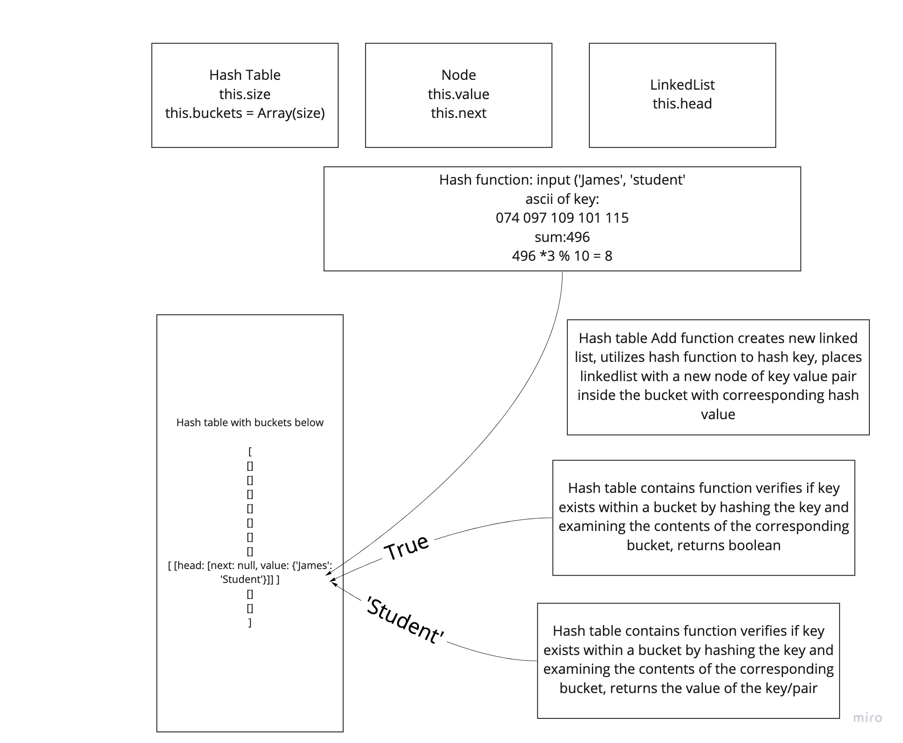

# Hash table
Code Challenge 30 of Code Fellows Class 401

## Challenge
* Create a Hash Table class with the following functions; hash, add, contains, and get

## Approach & Efficiency
I took the approach of utilizing a Linked List for each bucket in my hash table and nodes within that linked list. Big O space is O(n) and big O time is O(1)

## Solution

