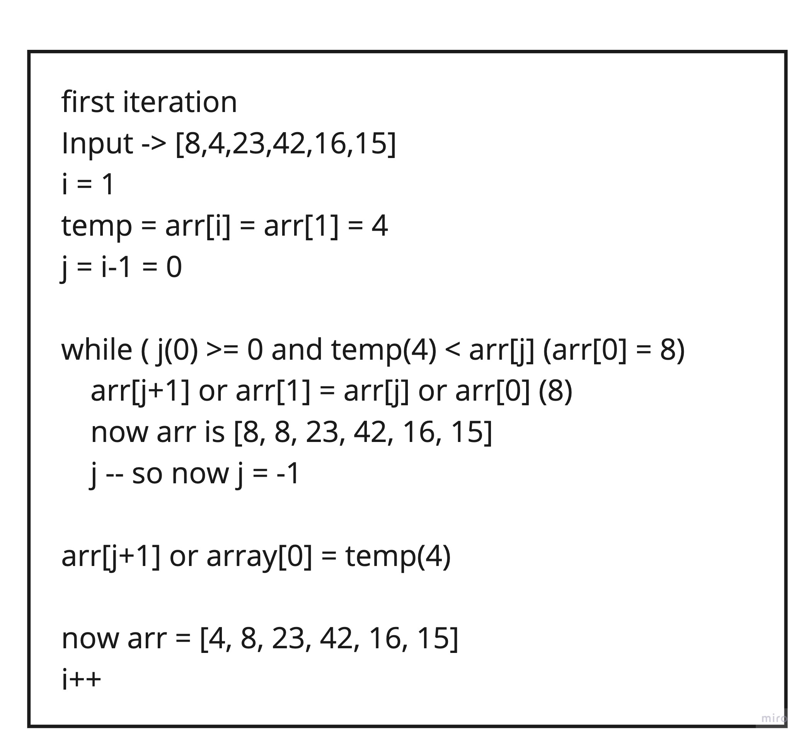
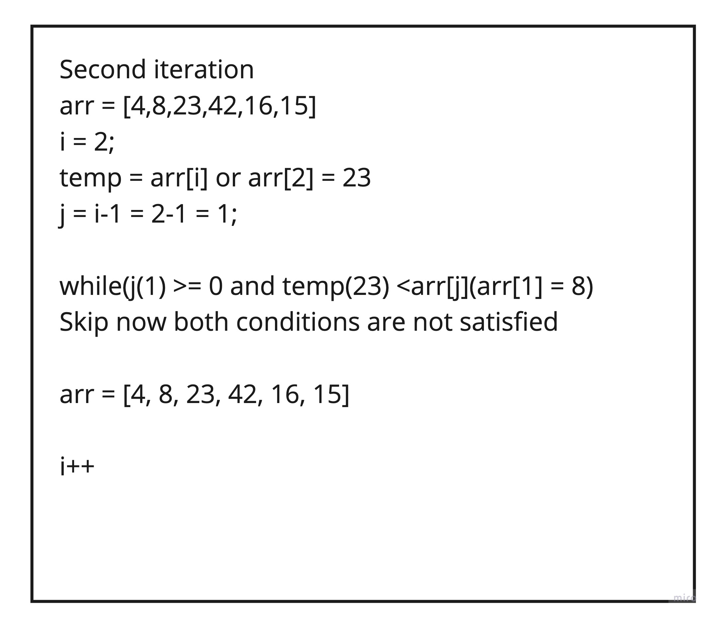
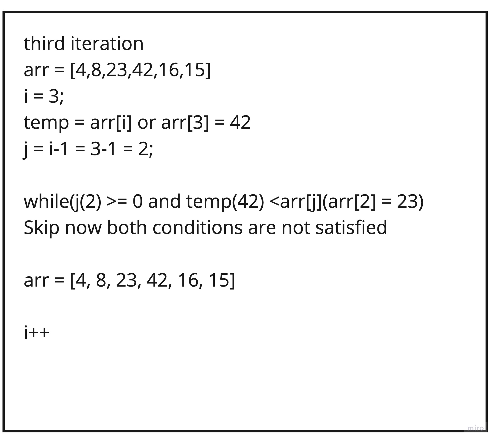
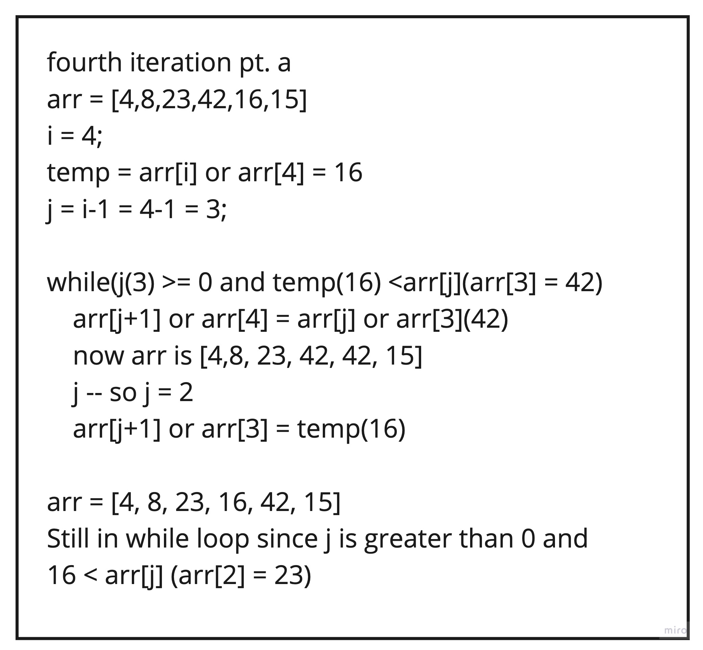
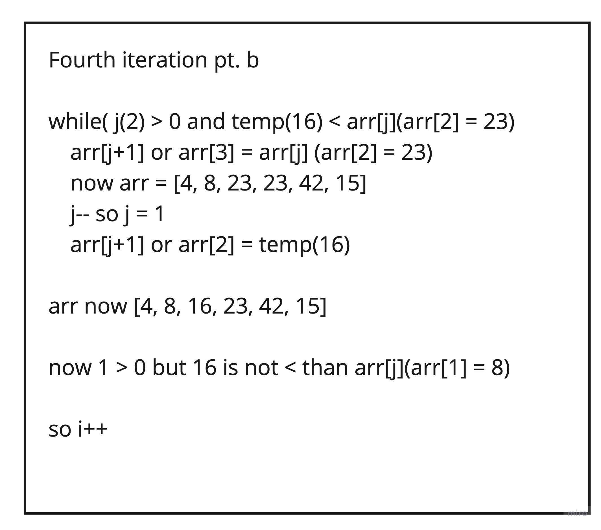
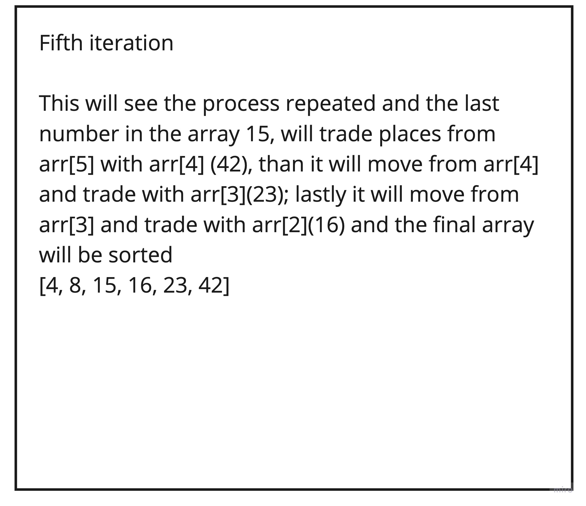

# Walkthrough of a Insertion Sort Function

## Below is a visual walkthrough of using an insertion sort function to properly sort a provided array. This function utilizes a traversal method to compare previous values of the array with a current value and switches their places based on which is greater

* ```Input -> arr = [8,4,23,42,16,15]```

* In this first step we will examine the first value of the array and compare it with the second value of the array. if the second value in the array is smaller we will swap them. This is indeed the case and as a result the 8 and 4 are swapped in their positioning


* In this second iteration, we will compared the second and third values of the array, we can see that the 23 is greater than the 8 and therefore there is no need to move either of them. Also because 23 is greater than 8, it must therefore be greater than 4 as well due to our earlier sorting.


* In our third iteration we compare the third and fourth values of the array, like our last iteration we can see that 42 is greater than 23 and therefore there is no need to move any values


* Now that we are on our fourth iteration we see that 16 is indeed smaller than 42 and as a result of this we will need to swap the two values, however, we are not done yet.


* Because 16 is also smaller than the value preceding it, 23, our while loop will continue and the 23 and 16 will be switched as well. Then since 16 is greater than 8 the while loop will stop and we will move on to our fifth iteration


* Lastly we arrive to the 15 at the end of the array. At this point we know what will happen, the 15 will be compared to 42 and swapped, compared to 23 and be swapped, compared to the 16 and swapped and then when compared to 8 the while loop will break. And since this is our last iteration we will break out of our for loop as well.


* Now that we've worked through our for loop all that is left to do is to return our sorted array
* ```output -> arr = [4, 8, 15, 16, 23, 42]```