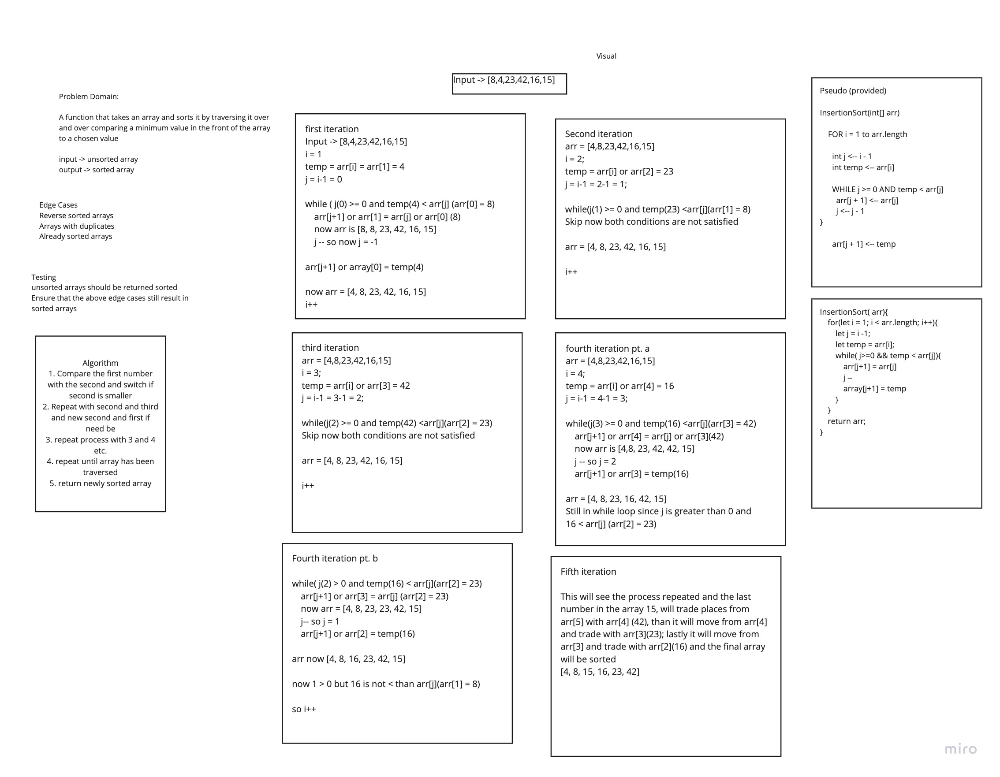

# Insertion Sort 
Code Challenge 26 of Code Fellows Class 401

## Challenge
Create a function that will traverse and array and sort while doing so by inserting lesser values before greater ones in the array

## Approach & Efficiency
The approach I took was working through a whiteboard for this process. I utilized the pseudo code to create a visual walkthrough and then using my understanding of the process afterwords I wrote the code. This approach has a big O space of O(1) and time of O (n^2);

## Solution
