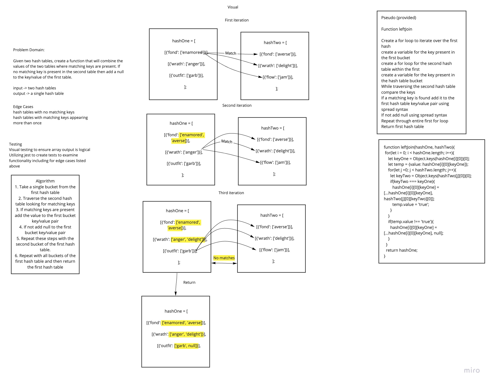

# Left Join
Code Challenge 33 of Code Fellows Class 401

## Challenge
Given two hash tables, create a function that will combine the values of the two tables where matching keys are present. If no matching key is present in the second table than add a null to the key/value of the first table.
## Approach & Efficiency
I took the approach of utilizing an iterative approach to check for matching key pairs in the two tables. Because of this there is a Big O space of O(1) and a time of O(n^2)

## Solution
