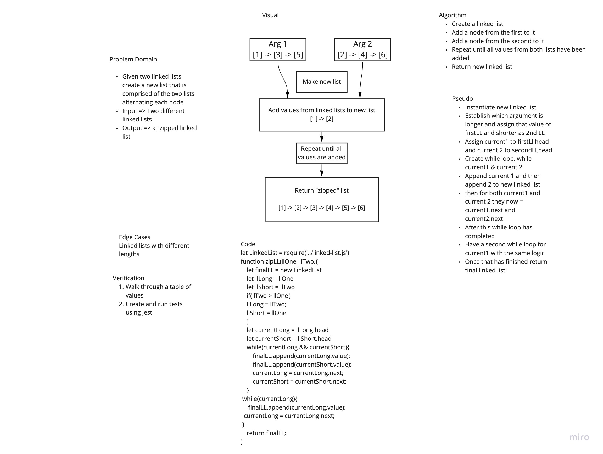

# Zip Linked List
Code Challenge 08 of Code Fellows Class 401

## Challenge
Create a function that will take two linked lists and create a new list with the alternating values of the first two

## Approach & Efficiency
The approach I took was working through a whiteboard for this process. I assigned each list head to a current value and used a while loop to cycled through them while appending each one to the list at each node. My while parameter was when they both had a current value and then I created two subsequent while loops with each individual current as a limiting factor so that whichever list was longer would then continue to append values to the final list. My big O time was O(n) and my space was O(1);

## Solution
