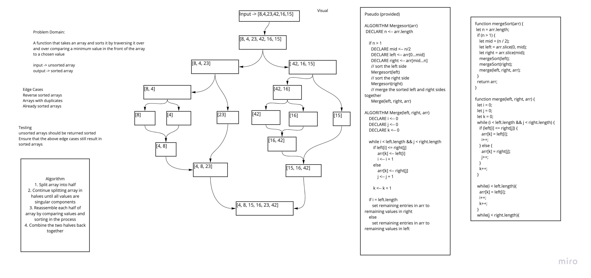

# Walkthrough of a Merge Sort Function

## Below is a visual walkthrough of using an merge sort function to properly sort a provided array. This function utilizes a breaking down and than comparison of individual components approach before re-assembling the array

* ```Input -> arr = [8,4,23,42,16,15]```

* 

* In the above image, the first steps illustrate the deconstruction of the array into individual components.
* This is followed by the comparison of these components in either half, left or right.
* On the left hand side we have the comparison of 8 and 4 with the latter being the lesser giving us a new unit of [4, 8].
* This is followed by the comparison of 23 with our new unit which results in [4, 8, 23].
* On the right hand side we have a comparison of the first two components 16 and 42 yielding [16, 42].
* This is followed by the comparison of 15 to this newly formed unit giving us [15, 16, 42]
* Lastly the two halves are compared and we end with [4, 8, 15, 16, 23, 42] or in other words our input array is returned as a sorted array.


