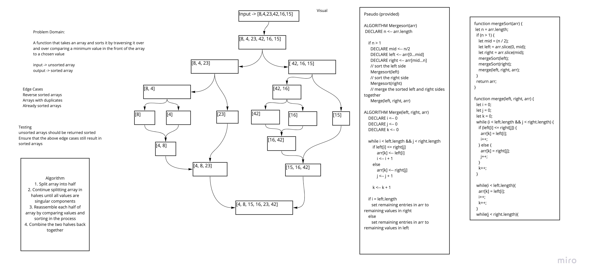

# Insertion Sort 
Code Challenge 27 of Code Fellows Class 401

## Challenge
Create a function that will split an array at halfway points until it is individual components and then selectively compare these components and sort while re-assembling

## Approach & Efficiency
The approach I took was working through a whiteboard for this process. I utilized the pseudo code to create a visual walkthrough and then using my understanding of the process afterwords I wrote the code. This approach has a big O space of O(1) and time of O (nLog(n));

## Solution
