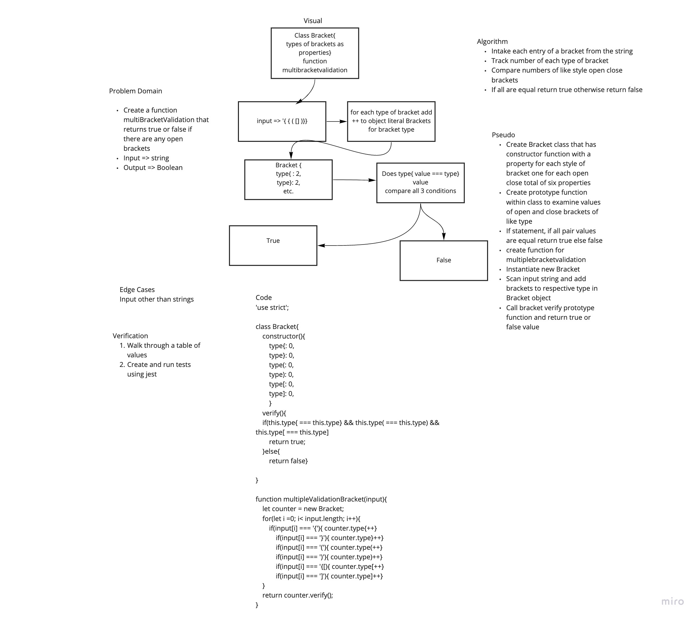

# Queue with Stacks
Code Challenge 13 of Code Fellows Class 401

## Challenge
* Create a function that intakes a string and returns true if all types of brackets have their respective closing brackets within the string.

## Approach & Efficiency
* I took the approach of creating functions with O(1) and O(n) Big O space/time.

## Solution
