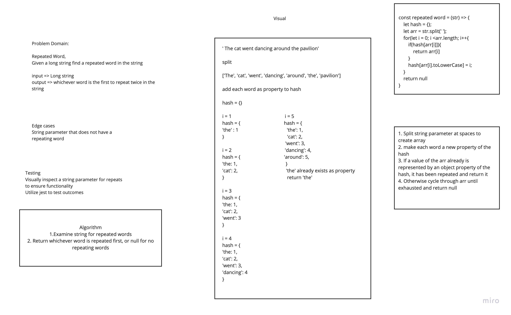

# Repeated Word
Code Challenge 31 of Code Fellows Class 401

## Challenge
* Create a function called repeated word that returns a word that is repeated within a long string.

## Approach & Efficiency
* I took of utilizing a pseudo hash table so that I could have a big O space of O(1) and time of O(n);

## Solution
