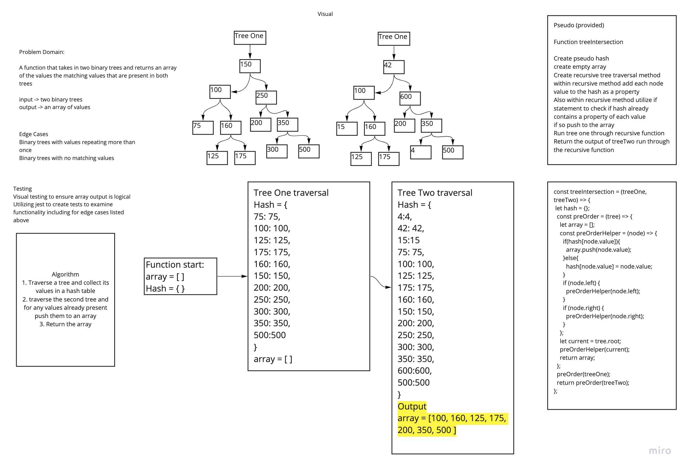

# Tree Intersection
Code Challenge 32 of Code Fellows Class 401

## Challenge
* Create a function called tree intersection that takes in two binary trees and returns an array of the values that are present in both trees

## Approach & Efficiency
* I took of utilizing a pseudo hash and a recursive traversal of the trees. Because of the tree traversal the big O time is O(h) and the space is O(1);

## Solution
